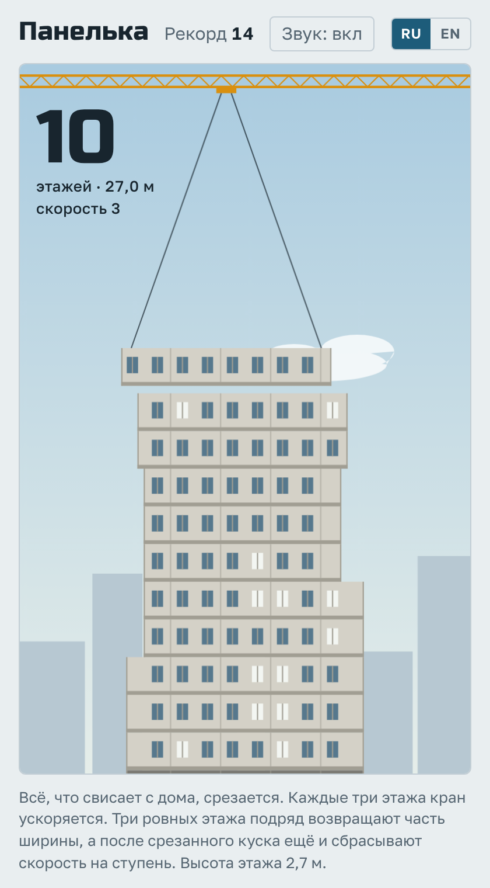
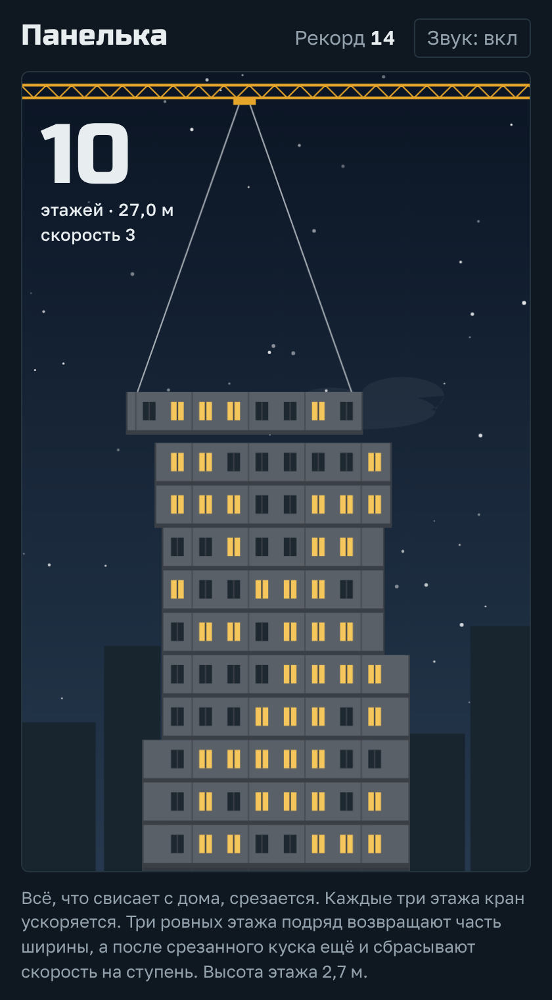

# Панелька

Браузерная игра на реакцию. Башенный кран возит этажи панельного дома, а вы одним нажатием ставите их друг на друга. Чем ровнее, тем выше дом.

*A one-button browser game: a tower crane carries the floors of a panel apartment block, and you stack them as straight as you can.*

**[Играть в браузере](https://posoxai.github.io/PanelHouseBuildGame/)**

  
  

Слева светлая тема, справа тёмная.

## Как играть

Нажмите на поле или пробел (Enter тоже работает), когда этаж окажется над домом.

- Всё, что свисает с дома, срезается, и следующий этаж становится уже.
- Этаж, поставленный мимо дома, заканчивает стройку.
- Этаж считается ровным, если он встал почти точно на предыдущий.

## Правила скорости и ширины

- Кран ускоряется на одну ступень каждые три поставленных этажа. Текущая ступень показана под счётчиком этажей.
- Три ровных этажа подряд возвращают часть ширины. Каждый следующий ровный этаж в серии возвращает ещё немного, пока дом не вернётся к исходной ширине.
- Если до этой серии был срезан кусок, третий ровный этаж ещё и сбрасывает скорость на одну ступень. Сброс срабатывает один раз на каждый срез.
- Когда сброс совпадает с плановым ускорением, они гасят друг друга, и скорость остаётся прежней.

## Звания

Сданный дом получает звание по числу этажей.

| Этажей | Звание |
| --- | --- |
| 0 | Котлован |
| 1–4 | Недострой |
| 5–8 | Хрущёвка |
| 9–11 | Девятиэтажка |
| 12–15 | Двенадцатиэтажка |
| 16–24 | Шестнадцатиэтажка |
| 25–39 | Высотка |
| 40 и больше | Небоскрёб |

Высота этажа в игре 2,7 м, поэтому рядом со счётом показана высота дома в метрах.

## Как запустить

Вся игра лежит в одном файле `index.html`. Сборка и зависимости не нужны.

- Локально: откройте `index.html` в браузере.
- По ссылке: игра опубликована через GitHub Pages по адресу https://posoxai.github.io/PanelHouseBuildGame/. Каждый коммит в `main` обновляет её автоматически.

Шрифты загружаются с Google Fonts. Без сети игра работает на системных шрифтах.

Рекорд и настройка звука хранятся в браузере игрока. Светлая тема рисует дом днём, тёмная — ночью, с горящими окнами.

## Авторство

Игру придумал, нарисовал и написал Claude, ИИ-ассистент компании Anthropic: механику, графику на canvas, звук и оформление страницы.

Идея сделать браузерную игру и правила скорости (ступени каждые три этажа и сброс после трёх ровных этажей) принадлежат posoxAI.
